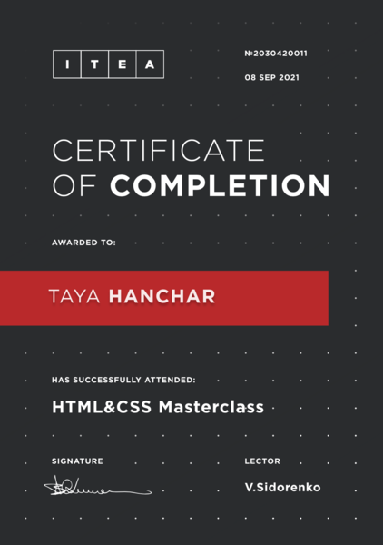
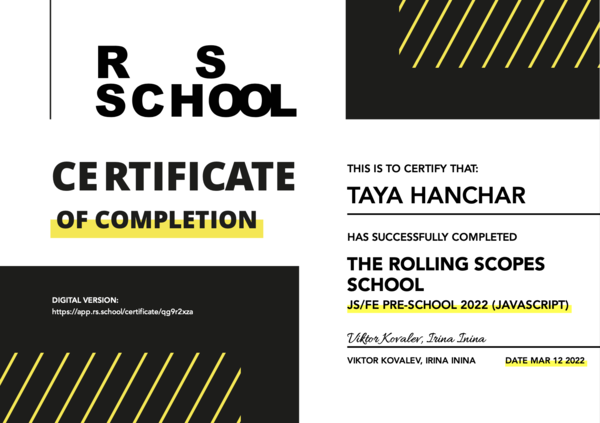
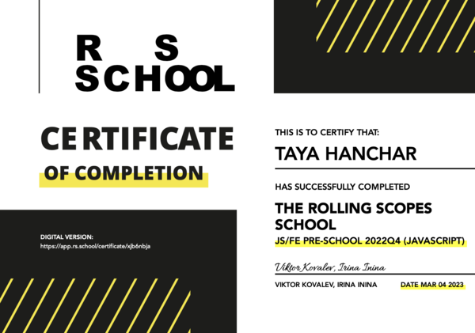
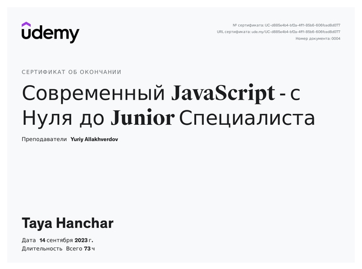

# Taya Hanchar


## Contacts
* __Location:__ Vilnius, Lithuania
* __E-mail:__ tayahanchar@gmail.com
* __GitHub:__ [tayahanchar](https://github.com/tayahanchar)
* __Discord:__ Taya#1628


## About Me

My background includes extended experience of interaction with clients (particularly, in hiring personal and sales), so I have good communication skills.
I am currently studying JavaScript and React. In the future, I plan to enhance my skills in front-end development.

## Skills

* HTML
* CSS
* Preprocessor SASS
* Git, GitHub
* Visual Studio Code / WebStorm
* Figma 
* Webpack
* JavaScript
* TypeScript
* React

## Code example

```
function showListOfFilms(arr) {
    return  arr.reduce((acc, item) => [...acc, item.name], []).join(', ');
}
```

## Education

__University:__ Francisk Skorina Gomel State University, historian-museologist

__Courses:__ 
* IT Education Academy (ITEA) "HTML&CSS masterclass" (08.09.2021)
* RS School Course "JS/FE PRE-SCHOOL 2022 (JAVASCRIPT)" (12.03.2022)
* RS School Course "JS/FE PRE-SCHOOL 2022Q4 (JAVASCRIPT)" (04.03.2023)
* Udemy Course "Современный JavaScript - с Нуля до Junior Специалиста"(18.09.2023)
* Udemy Course "Полный курс по JavaScript + React - с нуля до результата"
* Udemy Course "Полный курс по современному TypeScript"







## Experience

Training projects:

* [library](https://tayahanchar.github.io/library/)
* [museum](https://tayahanchar.github.io/museum/)
* [shelter](https://rolling-scopes-school.github.io/tayahanchar-JSFE2022Q1/shelter/)
* [eco-sounds App](https://rolling-scopes-school.github.io/tayahanchar-JSFEPRESCHOOL/eco-sounds/)
* [petStory](https://rolling-scopes-school.github.io/tayahanchar-JSFE2022Q3/online-zoo/pages/petstory/)
* [portfolio](https://rolling-scopes-school.github.io/tayahanchar-JSFEPRESCHOOL/portfolio/)
* [plants](https://rolling-scopes-school.github.io/tayahanchar-JSFEPRESCHOOL2022Q4/plants/)

## Languages

* English level - B1
* German level - A1
